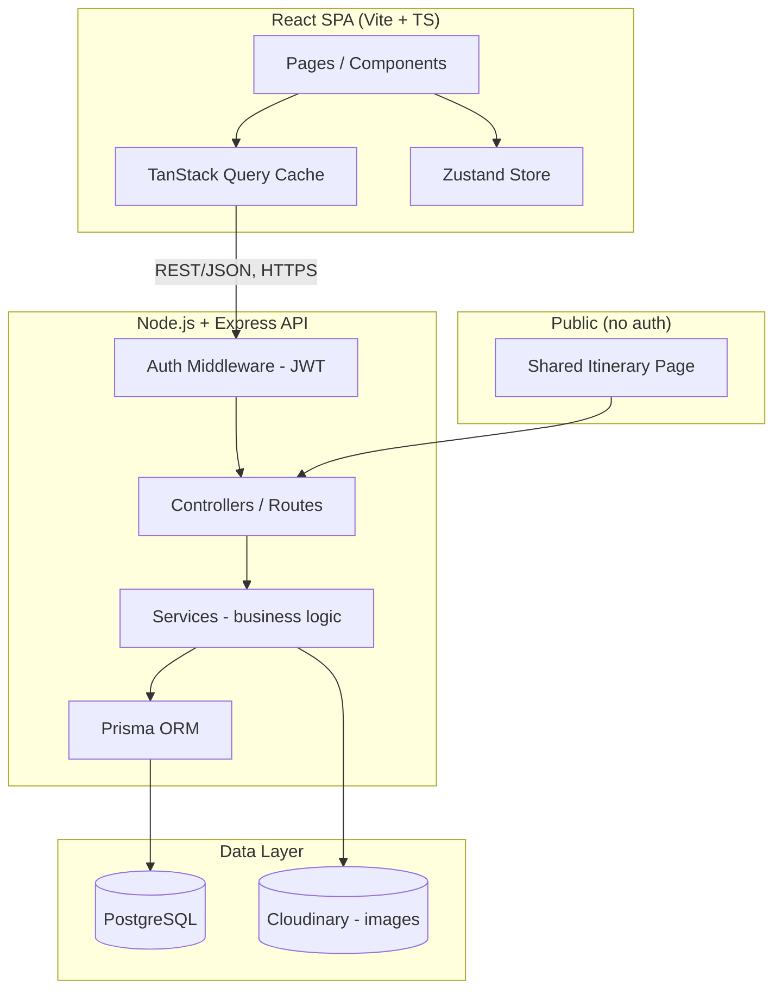
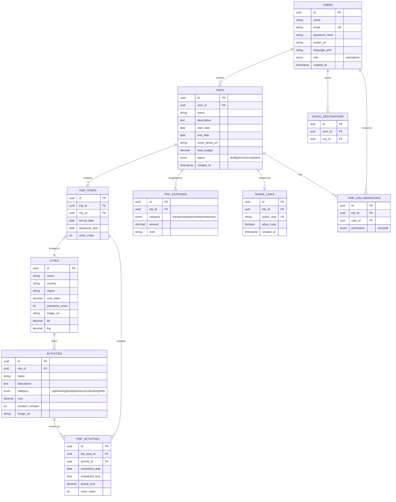

# GlobeTrotter — Full Technical Architecture, Roadmap & Team Plan

**Stack:** React (frontend) · Node.js/Express (backend) · PostgreSQL (database)
**Team size:** 3 people, everyone full-stack on their own vertical (no pure "frontend-only" / "backend-only" person)
**Goal:** A hackathon-winning, fully responsive, production-quality MVP of GlobeTrotter (all 13 screens from the problem statement).

> **Design references used for this update:**
> - **[tripadvisor.in](https://www.tripadvisor.in/)** — inspected live to pull the actual production color palette and UI patterns; see Section 5.4/5.5 for the extracted hex codes and reusable component patterns.
> - **[Excalidraw mockup](https://app.excalidraw.com/l/65VNwvy7c4X/6CzbTgEeSr1)** given in the problem statement — this is a **live collaborative board** owned by `odoo-rd`, and joining it (even as guest/read-only) failed with an auth error (`NoTokenError: No token`) in this session. The visible thumbnail confirms the board is a grid of wireframes matching the same 13 screens already detailed in this roadmap (Section headings below mirror that structure), but exact field-level wireframe detail couldn't be read at that resolution. **If you have access, open it yourself and flag anything that differs from Sections 5.2–5.5 below** — those sections should then be adjusted to match the actual mockup rather than this doc's assumptions.

---

## Table of Contents
1. [Tech Stack (with trending additions)](#1-tech-stack)
2. [High-Level Architecture](#2-high-level-architecture)
3. [Database Design (ERD + schema)](#3-database-design)
4. [API Design](#4-api-design)
5. [Fully Responsive Design System](#5-fully-responsive-design-system)
6. [Phase-Wise Development Plan](#6-phase-wise-development-plan)
7. [Team Split — Who Owns What](#7-team-split)
8. ["Wow Factor" Ideas to Win](#8-wow-factor-ideas)
9. [Non-Functional Checklist](#9-non-functional-checklist)
10. [Deployment Plan](#10-deployment-plan)

---

## 1. Tech Stack

### Core (as required by problem statement)
| Layer | Choice | Why |
|---|---|---|
| Frontend | **React 18 + Vite + TypeScript** | Fast HMR, type safety catches bugs during a time-pressured hackathon |
| Styling | **Tailwind CSS + shadcn/ui** | Utility-first = fast responsive UI; shadcn gives accessible pre-built components (dialogs, dropdowns, calendars) you don't have to build from scratch |
| Routing | **React Router v6** | Standard SPA routing |
| Server state | **TanStack Query (React Query)** | Caching, auto-refetch, loading/error states handled for you — huge time saver over manual `useEffect` fetch |
| Client/UI state | **Zustand** | Lightweight, no boilerplate (better than Redux for a hackathon timeline) |
| Forms | **React Hook Form + Zod** | Schema validation shared between frontend and backend logic style |
| Backend | **Node.js + Express + TypeScript** | Familiar, huge ecosystem, fast to scaffold REST APIs |
| ORM | **Prisma** | Type-safe DB access, auto-generates migrations, great with PostgreSQL, has a visual schema file that doubles as documentation |
| Database | **PostgreSQL** | Required — relational integrity for Users/Trips/Cities/Activities |
| Auth | **JWT (access + refresh token) + bcrypt** | Stateless auth, refresh token rotation for security |
| File/Image upload | **Cloudinary** (free tier) | Cover photos, avatars — no need to manage your own S3 bucket during a hackathon |
| Validation | **Zod** (shared types package) | Same schema reused on client and server |
| Charts | **Recharts** | Budget pie/bar charts (#9) |
| Calendar/Timeline | **FullCalendar** or custom with `date-fns` + `@dnd-kit` | Drag-drop reorder (#5, #10) |
| Maps (optional wow) | **React-Leaflet + OpenStreetMap** | Free, no API key needed, shows city pins on itinerary |
| Realtime (optional wow) | **Socket.IO** | Live collaboration if 2 people edit same trip |
| PWA | **vite-plugin-pwa** | Offline access to saved itineraries — nice differentiator |
| Testing | **Vitest + React Testing Library** (frontend), **Jest/Supertest** (backend) | Minimum smoke tests for judges who check code quality |
| CI/CD | **GitHub Actions** | Auto lint + test on push |
| Containerization | **Docker + docker-compose** (Postgres + API + web) | One-command local setup — impresses judges when they run it themselves |
| Hosting | Frontend: **Vercel** · Backend: **Render/Railway** · DB: **Neon/Supabase (managed Postgres)** | All free tiers, fast to deploy |

### Why these are "trending" and worth the marks
- **Prisma + PostgreSQL** = modern type-safe DB layer, very popular in 2024-2026 stacks, easy to show a clean `schema.prisma` file as your "relational database proof" to judges.
- **TanStack Query + Zustand** = current best-practice replacement for old-school Redux, less code, fewer bugs.
- **shadcn/ui** = the most-used component approach right now (copy-paste + Tailwind, fully customizable, accessible by default) — makes UI look premium fast.
- **Zod shared validation** = "single source of truth" schema, a genuinely modern pattern interviewers/judges recognize.
- **PWA + offline** = not required, but almost no hackathon team does it — strong wow factor with low effort using `vite-plugin-pwa`.

---

## 2. High-Level Architecture



### Folder structure (monorepo, keeps 3 people from stepping on each other)

```
globetrotter/
├── apps/
│   ├── web/                # React frontend
│   │   ├── src/
│   │   │   ├── pages/          # one folder per screen (13)
│   │   │   ├── components/     # shared UI (Button, Card, Modal...)
│   │   │   ├── features/       # feature-based: trips/, cities/, activities/, budget/, auth/
│   │   │   ├── hooks/
│   │   │   ├── store/           # zustand
│   │   │   ├── lib/             # api client, query client
│   │   │   └── styles/
│   └── api/                # Express backend
│       ├── src/
│       │   ├── modules/        # auth/, trips/, cities/, activities/, budget/, admin/
│       │   │   └── each module: controller.ts, service.ts, routes.ts, schema.ts (zod)
│       │   ├── middleware/
│       │   ├── prisma/
│       │   │   ├── schema.prisma
│       │   │   └── migrations/
│       │   └── server.ts
├── packages/
│   └── shared/              # shared TS types + zod schemas used by both web & api
├── docker-compose.yml
└── .github/workflows/ci.yml
```

> **Key idea:** backend is organized by **feature module**, not by generic "routes/controllers/models" folders — this maps 1:1 to how work is split across 3 people (see Section 7).

---

## 3. Database Design

### 3.1 Entity Relationship Diagram



### 3.2 Design notes (why it's structured this way)

- **`TRIP_STOPS` is the join table between Trips and Cities** — this is what lets a trip have Mumbai (3 days) → Goa (2 days) → Kerala (4 days) with independent dates and order (`order_index` for drag-reorder in the Itinerary Builder).
- **`TRIP_ACTIVITIES` is a join table between `TRIP_STOPS` and `ACTIVITIES`** — an activity (e.g. "Scuba diving") is a catalog item tied to a city; when a user adds it to their trip, we create a row here with the *actual* scheduled date/time/cost (cost can differ slightly from the catalog price — supports "estimate vs actual").
- **`TRIP_EXPENSES` is separate from `TRIP_ACTIVITIES` cost** so a user can log misc/transport/stay costs not tied to a specific bookable activity — this is what powers Screen #9's full pie/bar breakdown.
- **`SHARE_LINKS`** gives a stable public slug (`/shared/abc123`) decoupled from the trip's real UUID — good practice, avoids exposing internal IDs, and lets you revoke sharing without deleting the trip.
- **`TRIP_COLLABORATORS`** is optional-but-cheap to add now — it's what unlocks the realtime "wow factor" collaboration feature later (Section 8) without a schema migration mid-hackathon.
- Every cost field is `decimal`, not float — avoids floating point rounding bugs in budget totals (a judge will absolutely try to break your budget math).
- Indexes to add: `trips(user_id)`, `trip_stops(trip_id)`, `trip_activities(trip_stop_id)`, `cities(name)` (for search), `share_links(public_slug)`.

---

## 4. API Design

REST, versioned under `/api/v1`. Grouped by module (matches team split in Section 7).

### Auth (`/api/v1/auth`) — Vertical A
```
POST   /signup
POST   /login
POST   /logout
POST   /refresh-token
POST   /forgot-password
POST   /reset-password
GET    /me
```

### Users / Profile (`/api/v1/users`) — Vertical A
```
GET    /me/profile
PATCH  /me/profile
DELETE /me
GET    /me/saved-destinations
POST   /me/saved-destinations/:cityId
DELETE /me/saved-destinations/:cityId
```

### Cities & Activities (`/api/v1/cities`, `/api/v1/activities`) — Vertical A
```
GET    /cities?search=&region=&country=&sort=popularity
GET    /cities/:id
GET    /cities/:id/activities?category=&maxCost=&maxDuration=
GET    /activities/:id
```

### Trips (`/api/v1/trips`) — Vertical B
```
GET    /trips                     # "My Trips" list
POST   /trips                     # Create Trip
GET    /trips/:id
PATCH  /trips/:id
DELETE /trips/:id
POST   /trips/:id/cover-photo

POST   /trips/:id/stops           # Add stop (city+dates) -> Itinerary Builder
PATCH  /trips/:id/stops/:stopId
DELETE /trips/:id/stops/:stopId
PATCH  /trips/:id/stops/reorder   # drag-drop reorder

POST   /trips/:id/stops/:stopId/activities
PATCH  /trips/:id/stops/:stopId/activities/:activityId
DELETE /trips/:id/stops/:stopId/activities/:activityId

GET    /trips/:id/itinerary       # full computed itinerary (Screen #6)
```

### Budget (`/api/v1/trips/:id/budget`) — Vertical C
```
GET    /trips/:id/budget                 # breakdown by category
POST   /trips/:id/budget/expenses
PATCH  /trips/:id/budget/expenses/:id
DELETE /trips/:id/budget/expenses/:id
GET    /trips/:id/budget/daily-average
```

### Calendar (`/api/v1/trips/:id/calendar`) — Vertical C
```
GET    /trips/:id/calendar        # day-by-day grouped view for Screen #10
```

### Sharing (`/api/v1/share`) — Vertical C
```
POST   /trips/:id/share            # generate public slug
DELETE /trips/:id/share
GET    /share/:slug                # PUBLIC, no auth — Screen #11
POST   /share/:slug/copy           # "Copy Trip" into logged-in user's account
```

### Admin (`/api/v1/admin`) — Vertical C (optional screen)
```
GET    /admin/stats/overview
GET    /admin/stats/top-cities
GET    /admin/stats/top-activities
GET    /admin/users
PATCH  /admin/users/:id/role
```

> All non-public routes go through a shared `authMiddleware` (checks JWT) built once in **Phase 1** by whoever finishes setup fastest — this is the one piece that must NOT be duplicated 3 times.

---

## 5. Fully Responsive Design System

This is a required judging criterion ("across desktop or mobile platforms") — treat it as a first-class spec, not an afterthought.

### 5.1 Breakpoints (Tailwind defaults, used consistently everywhere)

| Name | Width | Target Device |
|---|---|---|
| `base` (no prefix) | `0 – 639px` | **Mobile** (portrait phones) |
| `sm:` | `640px+` | **Mobile landscape / small phones** |
| `md:` | `768px+` | **Tablet** (portrait, e.g. iPad) |
| `lg:` | `1024px+` | **Tablet landscape / small laptop** |
| `xl:` | `1280px+` | **Laptop / Desktop** |
| `2xl:` | `1536px+` | **Large desktop / wide monitor** |

**Rule of thumb:** design mobile-first. Write base (mobile) styles with no prefix, then add `md:` / `lg:` / `xl:` overrides. Never design desktop-first and squeeze down — that's how hackathon UIs break on mobile at 11pm.

### 5.2 Global layout rules

| Element | Mobile (`base`–`sm`) | Tablet (`md`) | Laptop/Desktop (`lg`+) |
|---|---|---|---|
| **Navigation** | Bottom tab bar (Home / My Trips / Search / Profile) + hamburger for extras | Collapsible left sidebar (icons only, expands on tap) | Full left sidebar with icons + labels, always visible |
| **Page width** | Full width, 16px side padding | Full width, 24px padding, max content width 720px centered for forms | Max width 1200–1400px centered, generous whitespace |
| **Grid columns** | 1 column (stacked) | 2 columns for cards (Trip cards, City cards) | 3–4 columns for cards |
| **Modals** | Full-screen sheet (slide up from bottom) | Centered modal, 80% width | Centered modal, fixed max-width (480–640px) |
| **Tables (admin)** | Convert to stacked card list | Horizontal scroll table | Full table |
| **Font scale** | Base 14–16px, H1 24px | Base 16px, H1 28px | Base 16px, H1 32–36px |
| **Touch targets** | Min 44×44px (buttons, icons) | Same | Can be tighter (36–40px) since mouse-driven |

### 5.3 Per-screen responsive notes

- **Login/Signup:** single centered card, max-width 400px on all sizes — just vertically centers differently (full-height on mobile, card-in-viewport on desktop).
- **Dashboard:** mobile = vertical stack (welcome → quick action → trip cards → suggestions); desktop = 2-column (main feed left, "quick actions + suggestions" sidebar right).
- **Itinerary Builder (#5):** this is the hardest to make responsive.
  - Mobile: single column, one "stop card" at a time, expand/collapse to add activities, reorder via up/down arrow buttons (drag is fiddly on touch — provide both drag AND buttons).
  - Desktop: two-pane layout — left pane = ordered list of stops (draggable), right pane = detail panel for selected stop's activities. This is the "premium app" feel judges notice.
- **Itinerary View / Calendar (#6, #10):** mobile = vertical day-by-day accordion (agenda view); desktop = full calendar grid (week/month) using FullCalendar's responsive views (`listWeek` on mobile, `dayGridMonth` on desktop) — FullCalendar has this switching built in, use it.
- **Budget breakdown (#9):** charts (Recharts) must use `ResponsiveContainer` — pie chart shrinks and legend moves below chart on mobile, sits beside chart on desktop.
- **City/Activity Search (#7, #8):** mobile = filters in a bottom sheet triggered by a "Filters" button; desktop = filters as a permanent left rail beside results grid.
- **Public Shared Itinerary (#11):** must look great with zero login on any device since it's the thing people share on WhatsApp/Instagram — treat this as your "marketing page," design it a little extra.

### 5.4 Color Palette — TripAdvisor-Inspired

> Extracted directly from **tripadvisor.in**'s live computed styles (main search page) so these are the *actual* production hex codes TripAdvisor ships, not a guess. Reference used per your request: [tripadvisor.in](https://www.tripadvisor.in/).

**Why TripAdvisor's palette is a smart borrow for GlobeTrotter:** it's a travel-domain product judges will subconsciously recognize as "trustworthy travel UI," it's built around one very high-contrast accent color (easy for 3 people to apply consistently), and the dark-text-on-bright-green button pattern is genuinely more accessible (higher contrast ratio) than the white-text-on-green most teams default to — copy that detail exactly, it reads as polish.

| Token | Hex | Where TripAdvisor uses it | Where you use it in GlobeTrotter |
|---|---|---|---|
| `brand-green` (primary) | **`#00EB5B`** | "Search" button, hero banner fill, active-state accents | Primary CTAs: "Plan New Trip", "Add to Trip", "Save Activity", "Search", primary form submit buttons |
| `ink` (primary text / dark surface) | **`#002B11`** | All body text & headings, "Sign in" button background | Body text & headings everywhere; also as a *dark* secondary-button background (e.g. "Export PDF", "Copy Trip") |
| `surface` (neutral off-white) | **`#F7F7F7`** | Alternating section backgrounds behind card rows | Page background; alternate it with `surface-white` between sections (Dashboard feed, City grid, Budget page) so sections visually separate without borders |
| `surface-white` | **`#FFFFFF`** | Cards, navbar, modals, search bar | Card backgrounds, navbar, modals, the Itinerary Builder panels |
| `night` (true black) | **`#000000`** | Secondary solid button ("Book now") | Secondary solid buttons where you want higher contrast than `ink` (rare — use sparingly) |
| `on-dark` (text/icons on dark bg) | **`#F7F7F7`** | Text on green/black/dark buttons | Any label placed on `brand-green`, `ink`, or `night` backgrounds |

**Semantic states** (not from TripAdvisor — GlobeTrotter-specific, but tuned to sit next to the green without clashing):

| Token | Hex | Use |
|---|---|---|
| `success` | `#1FAE5C` | "Within budget", saved successfully, trip published |
| `warning` | `#F5A623` | Budget nearing limit, date conflicts |
| `danger` | `#E5484D` | Over-budget alerts, delete confirmations, validation errors |
| `info` | `#2F80ED` | Tooltips, informational badges, "shared" indicator |

**Dark mode:** swap roles — `surface`/`surface-white` become `#0E1512`/`#151D19` (near-`ink`, not pure black), `ink` becomes `#F7F7F7`, `brand-green` stays the same `#00EB5B` (it already pops on dark backgrounds — TripAdvisor's own dark-themed surfaces, e.g. their Excalidraw/marketing dark pages, keep the identical green for this reason).

```ts
// tailwind.config.ts — colors block, decide together in Phase 0
colors: {
  brand: {
    DEFAULT: '#00EB5B',
    dark: '#00C94D',   // hover/active state, ~10% darker
  },
  ink: '#002B11',
  surface: {
    DEFAULT: '#F7F7F7',
    white: '#FFFFFF',
  },
  night: '#000000',
  success: '#1FAE5C',
  warning: '#F5A623',
  danger: '#E5484D',
  info: '#2F80ED',
}
```

### 5.5 Component Style Patterns Borrowed from TripAdvisor

Concrete, reusable patterns observed on tripadvisor.in — copy these interaction/layout patterns (not their content) into the matching GlobeTrotter screen:

| TripAdvisor pattern | What it looks like | Apply it to |
|---|---|---|
| **Sticky top navbar**: logo left, nav links center-right, one outlined "pill" highlight button, one solid dark "Sign in" pill on the far right | White bg, `ink` text/icons, green-outlined pill for a featured action | GlobeTrotter navbar: logo → Dashboard/My Trips/Explore links → green-outlined **"AI Trip Assistant"** pill (wow feature, Section 8) → dark `ink` **"Login/Profile"** pill |
| **Mega search bar**: full-rounded (`radius: full`) input, icon-left, two docked action buttons inside the bar's right edge (ghost "Ask AI" + solid green "Search") | Large, centered, impossible to miss | City Search (#7) and Activity Search (#8) search bars |
| **Split hero banner**: 50/50 photo + solid `brand-green` color block, oversized bold headline in `ink`, single dark pill CTA | High contrast, immediately readable | Dashboard's "Plan New Trip" hero; top of the Shared/Public Itinerary page (#11) — this is the page people screenshot and share, make it look like a hero |
| **Category tiles**: photo background, rounded-2xl corners, bold white label bottom-left over a dark gradient scrim | 4-across grid, instantly scannable | Activity category filters (Sightseeing / Food / Adventure / Culture / Nightlife) on Activity Search (#8) |
| **Cards with a floating save icon**: white bg, rounded-2xl, soft shadow only on hover, circular white heart-icon button (thin border) top-right | Clean, low-clutter | Trip cards (#4), City cards (#7), Activity cards (#8) — heart icon = "save destination" / "save to wishlist" |
| **Horizontal carousel with a circular outlined arrow button** at the row's edge | Scroll-snap row of cards + one nav affordance | "Recommended destinations" row on Dashboard (#2), "Popular activities" row on Activity Search |

**One rule to keep 3 people visually consistent:** whoever builds the shared `Button`, `Card`, `Input`, and `Navbar` components in Phase 0 encodes these exact tokens and patterns once — nobody else should hand-pick a color or radius value; everyone imports from the shared component library.

### 5.6 Spacing, Radius, Shadow, Type Tokens

```
Spacing:   4px base unit (4,8,12,16,24,32,48,64)
Radius:    sm(6px) md(10px) lg(16px) 2xl(20px, for cards — matches TripAdvisor's rounded card look) full(999px, for pill buttons & search bars)
Shadow:    sm (resting card), md (hover card), lg (modal/dropdown) — keep shadows subtle, TripAdvisor relies on whitespace + color blocks more than shadows
Font:      Inter (UI) + a bold display weight (e.g. Sora ExtraBold or Inter Black) for big headlines — TripAdvisor's headlines are very bold/heavy, lean into that for your Dashboard hero and Shared Itinerary page
Dark mode: supported via Tailwind `dark:` classes from day 1 (low cost, good wow factor)
```

Agree on all of Section 5.4–5.6 **once, together, in Phase 0** — if each person invents their own spacing/colors, the app will look like 3 different apps stitched together, which is the #1 way hackathon teams lose UI points.

---

## 6. Phase-Wise Development Plan

Assuming a typical hackathon window (~36–48 hrs) or a few sprint days — adjust hours to your actual timeline, but **keep the phase order**.

### Phase 0 — Foundation (do together, ~3–4 hrs, all 3 people)
- Finalize this doc's decisions: tech stack, design tokens, folder structure.
- Set up monorepo, Docker Compose (Postgres + API + Web), GitHub repo + branch protection.
- Write `schema.prisma` together (whiteboard the ERD in Section 3 first), run first migration, seed script with sample cities/activities (get ~20 cities, ~50 activities of dummy data — needed for demo).
- Build the shared component library skeleton: `Button`, `Input`, `Card`, `Modal`, `Navbar`, `Sidebar`, `PageContainer` — using the design tokens.
- Build `authMiddleware`, JWT utils, base Express app, base React app with routing + React Query + Zustand wired up.
- Agree on API contract shapes (use the endpoint list in Section 4 as the contract) so frontend and backend can build in parallel without blocking each other.

### Phase 1 — Auth + Navigation Shell (parallel, ~3 hrs)
- Vertical A builds Login/Signup + auth API fully working end-to-end.
- Vertical B & C scaffold their pages as routes with placeholder content, wire up the responsive Navbar/Sidebar shell from Phase 0 so navigation works app-wide immediately.

### Phase 2 — Core Trip CRUD (parallel, ~4 hrs)
- Vertical B: Create Trip, My Trips List — full CRUD, cover photo upload.
- Vertical A: Dashboard/Home (depends on Trip API existing — coordinate with B early), City Search.
- Vertical C: DB seed data quality + start Budget schema/API skeleton.

### Phase 3 — Itinerary Builder (the heart of the app, ~5–6 hrs)
- Vertical B leads Itinerary Builder + Itinerary View (needs City Search from A and Activity Search from A — define the API contract early, in Phase 0/1, so B can build against a mock while A finishes real endpoints).
- Vertical A: Activity Search screen.
- Vertical C: Budget & Cost Breakdown screen (consumes trip+activities data being built by B — again, agree on the `/budget` response shape early).

### Phase 4 — Calendar, Sharing, Profile (parallel, ~4 hrs)
- Vertical C: Trip Calendar/Timeline, Shared/Public Itinerary View + "Copy Trip".
- Vertical A: User Profile/Settings.
- Vertical B: polish Itinerary Builder drag-reorder, edge cases (overlapping dates, empty states).

### Phase 5 — Admin Dashboard (optional, if time allows, ~2–3 hrs)
- Vertical C builds Admin/Analytics using aggregate SQL queries (Prisma `groupBy`) — top cities, top activities, signups over time (Recharts line/bar).

### Phase 6 — Responsive Pass (all 3, ~3 hrs — do NOT skip)
- Each person tests **their own screens** at all 4 breakpoints (mobile/tablet/laptop/desktop) using browser devtools device toolbar.
- Fix layout breaks, touch target sizes, overflow issues.
- Cross-check: swap screens with a teammate for a fresh pair of eyes — you stop noticing your own screen's bugs after hours of staring at it.

### Phase 7 — Wow-Factor Features (if ahead of schedule, ~3–4 hrs)
- Pick 1–2 from Section 8, don't try all of them.

### Phase 8 — Polish, Testing, Deploy, Demo Prep (~3 hrs)
- Loading states, empty states, error toasts everywhere (a screen with a spinner forever looks broken to judges).
- Seed a few realistic full demo trips so the judge doesn't see an empty app.
- Deploy (Section 10), test the deployed link on an actual phone.
- Write a tight 2–3 minute demo script: problem → solution → live demo of Create Trip → Itinerary Builder → Budget → Share link opened on a phone.

---

## 7. Team Split — Who Owns What

**Principle:** each person owns a **vertical slice** (DB tables + API module + React pages), not "frontend guy" / "backend guy". This avoids one person being blocked waiting on another, and everyone can demo their own part end-to-end.

### Person A — "Identity & Discovery"
- **Screens:** #1 Login/Signup, #2 Dashboard, #7 City Search, #8 Activity Search, #12 Profile/Settings
- **DB tables owned:** `users`, `cities`, `activities`, `saved_destinations`
- **API modules:** `auth`, `users`, `cities`, `activities`
- Also owns: building the shared `authMiddleware` and JWT utils in Phase 0 (since it's their domain) for everyone else to use.

### Person B — "Trip Core & Itinerary"
- **Screens:** #3 Create Trip, #4 My Trips List, #5 Itinerary Builder, #6 Itinerary View
- **DB tables owned:** `trips`, `trip_stops`, `trip_activities`
- **API modules:** `trips` (including stops & activities sub-routes)
- This is the most complex vertical (drag-reorder, nested data) — pair with whoever is free during Phase 3 if behind schedule.

### Person C — "Money, Time & Sharing"
- **Screens:** #9 Budget/Cost Breakdown, #10 Calendar/Timeline, #11 Shared/Public View, #13 Admin/Analytics (optional)
- **DB tables owned:** `trip_expenses`, `share_links`, `trip_collaborators`
- **API modules:** `budget`, `calendar`, `share`, `admin`
- Also owns: the Recharts/FullCalendar integration patterns — write these once, share the pattern since Person B's Itinerary View also needs charts/calendar-like UI.

### Shared responsibilities (rotate, don't silo)
- **Design tokens & shared components (Section 5.4–5.6):** built together in Phase 0, then anyone can add a new shared component if they need one — post in your team chat before adding so you don't get 3 slightly different `Button` components.
- **Code review:** review each other's PRs, especially at module boundaries (e.g., Person A's City API response shape must match what Person B's Itinerary Builder expects — mismatches here are the #1 integration bug source).
- **Responsive QA (Phase 6):** everyone tests their own screens, then swaps with a teammate.
- **Demo prep:** all 3 rehearse the live demo together — if one person's part breaks live, another should be able to explain/drive it.

### Practical coordination tips
- Keep a **shared `API_CONTRACTS.md`** (or just a Notion/Google Doc) updated with each endpoint's request/response JSON shape *before* building it — this is what lets 3 people build frontend + backend in parallel without waiting on each other.
- Use **feature branches per person** (`feat/person-a-auth`, `feat/person-b-itinerary`), merge to `main` frequently (at least every phase) to avoid giant merge conflicts on the last day.
- Daily/hourly 5-minute syncs: "what did I finish, what am I blocked on, does my API shape need to change" — catches integration mismatches early.

---

## 8. "Wow Factor" Ideas

Pick **1–2 max**, implemented well, beats 5 done half-heartedly.

1. **AI Trip Assistant** — call an LLM API (e.g. via a simple prompt) to auto-suggest a day-by-day itinerary or activities based on trip dates/interests entered in Create Trip. Judges love visible AI integration in 2025-2026 hackathons.
2. **Real-time collaborative editing** — using the `trip_collaborators` table + Socket.IO, two people can edit the same Itinerary Builder and see each other's changes live (like Google Docs for trips).
3. **Interactive map view** — React-Leaflet showing pins for each city stop, connected by a route line, alongside the Itinerary View.
4. **PWA + offline mode** — once a trip is loaded, it's viewable offline (service worker caches it) — great for "at the airport with no signal" use case, ties back to the app's real-world purpose.
5. **Smart budget alerts** — proactively flag if a day's planned activities exceed the average daily budget, shown right in the Itinerary Builder (not just the Budget screen).
6. **Auto-generated shareable image** — when sharing a trip, generate an Instagram-story-style image card (city photos + dates) using an HTML canvas — much more shareable than a plain link.

---

## 9. Non-Functional Checklist

- [ ] Passwords hashed with bcrypt, never stored/logged in plaintext
- [ ] JWT secrets in `.env`, never committed (add `.env.example`)
- [ ] Input validation on both client (Zod + RHF) and server (Zod) — never trust client-only validation
- [ ] Rate limiting on auth routes (`express-rate-limit`) to show security awareness
- [ ] CORS configured properly (not `origin: *` in "production")
- [ ] SQL injection is a non-issue since Prisma parameterizes queries — but avoid any raw SQL string concatenation
- [ ] Basic accessibility: form labels, alt text on images, keyboard-navigable modals (shadcn/ui gives you most of this for free)
- [ ] Loading skeletons / spinners and empty states on every data-fetching screen
- [ ] 404 and error boundary pages
- [ ] Environment-based config (dev/prod API URLs)

---

## 10. Deployment Plan

1. **Database:** Neon or Supabase free-tier PostgreSQL — get the connection string early (Phase 0), don't wait until the end.
2. **Backend:** Render or Railway — connect GitHub repo, auto-deploy on push to `main`, set env vars (`DATABASE_URL`, `JWT_SECRET`, `CLOUDINARY_*`).
3. **Frontend:** Vercel — connect repo, set `VITE_API_URL` env var pointing to deployed backend.
4. **Custom domain (optional):** if you want a polished demo URL, a free Vercel subdomain is fine — don't waste time buying a domain.
5. **Deploy early and often** — deploy a "hello world" version in Phase 0 so the deployment pipeline is proven working before you're rushing at the deadline.

---

### TL;DR for the team
1. Phase 0 together: schema + design tokens + shared shell.
2. Each person owns a vertical (DB + API + UI) from Section 7 — build in parallel against agreed API contracts.
3. Responsive from day 1 using the breakpoint table in Section 5.
4. Add 1–2 wow features from Section 8 only if ahead of schedule.
5. Deploy early, rehearse the demo together.
